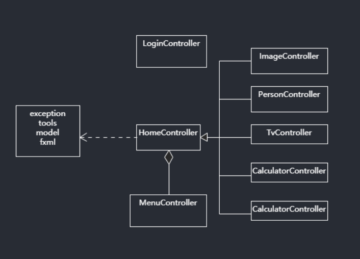

#### 使用

1. 下载项目
2. `mvn clear install`
3. 进入 `Launch.java` ， 运行 `main` 方法
4. 或 使用 `maven-assembly-plugin` 打成带依赖的jar包，运行指令 `java -jar XXX.jar`

#### 主要实现

1.  计算器
2. 日历
3. 联系人信息
4. 图片查看
5. 播放视频

#### 简述

1. 在程序设计时采用 `MVC` 设计模式，尽可能考虑了可扩展和可修改。
2. 将 `MenuController` 独立出来，嫁接到其他页面上，这是在程序写到一半时才发现的，后续可以将其他组件都单独提取出来，进行优化。

#### 简图

#### 

